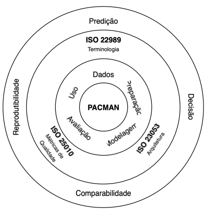
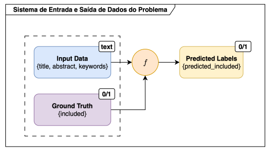

# Projeto de Mestrado



Projeto de mestrado focado na avaliação e comparação de diferentes modelos de Machine Learning para classificação de estudos em Revisões Sistemáticas da Literatura (RSL). O objetivo é identificar os modelos mais eficazes e contribuir para o desenvolvimento de uma base metodológica sólida que subsidie análises automatizadas futuras nesse domínio.

## 📋 Índice

- [Conceito e Arquitetura](#conceito-e-arquitetura)
- [Scripts Disponíveis](#scripts-disponíveis)
- [Notebooks de Análise](#notebooks-de-análise)
- [Configuração com Docker](#configuração-com-docker)
- [Instalação](#instalação)
- [Uso](#uso)
- [Estrutura do Projeto](#estrutura-do-projeto)

## 🏗️ Conceito e Arquitetura

### Visão Geral



Este projeto utiliza **Temporal** como orquestrador de workflows para executar experimentos de Machine Learning de forma distribuída e resiliente. A arquitetura é baseada em:

- **Workflows**: Orquestram o fluxo de execução dos experimentos
- **Activities**: Executam tarefas específicas (processamento, treinamento, etc.)
- **Workers**: Processam as tarefas em filas específicas

### Estrutura do Código (`src/`)

#### Workflows (`src/workflows/`)

Os workflows orquestram a execução dos experimentos:

- **`experiments_workflow.py`**: Workflow principal que executa todos os experimentos sequencialmente
  - Executa 5 experimentos: SVM, LSTM, LSTM+Attention, BiLSTM, BiLSTM+Attention
  - Coleta métricas de sistema (CPU, memória, throughput)
  - Gera relatórios consolidados

- **`data_preprocessing_workflow.py`**: Preprocessa dados brutos
  - Processa múltiplos arquivos em paralelo
  - Merge dos arquivos processados em um único dataset

- **`download_glove_vectors_workflow.py`**: Baixa vetores GloVe necessários para os experimentos

- **Workflows de Experimentos Individuais**:
  - `experiment_svm_with_glove_and_tfidf_workflow.py`
  - `experiment_lstm_with_glove_workflow.py`
  - `experiment_lstm_with_glove_and_attention_workflow.py`
  - `experiment_bi_lstm_with_glove_workflow.py`
  - `experiment_bi_lstm_with_glove_and_attention_workflow.py`

#### Activities (`src/activities/`)

As activities executam tarefas específicas:

- **Processamento de Dados**:
  - `process_files_activity.py`: Processa arquivos individuais
  - `merge_processed_files_activity.py`: Merge de arquivos processados
  - `prepare_data_for_experiment_activity.py`: Prepara dados para experimentos
  - `tokenizer_activity.py`: Tokenização de textos
  - `split_data_activity.py`: Divisão de dados (treino/validação/teste)

- **Download e Carregamento**:
  - `download_glove_vectors_activity.py`: Download de vetores GloVe
  - `load_glove_embeddings_activity.py`: Carrega embeddings GloVe

- **Execução de Experimentos**:
  - `run_experiment_svm_with_glove_and_tfidf_activity.py`
  - `run_experiment_lstm_with_glove_activity.py`
  - `run_experiment_lstm_with_glove_and_attention_activity.py`
  - `run_experiment_bi_lstm_with_glove_activity.py`
  - `run_experiment_bi_lstm_with_glove_and_attention_activity.py`

- **Utilitários**:
  - `generate_machine_specs_activity.py`: Gera especificações da máquina

#### Models (`src/models/`)

- **`attention.py`**: Implementação do mecanismo de atenção Bahdanau para modelos LSTM

#### Utils (`src/utils/`)

- **`calculate_metrics.py`**: Cálculo de métricas de avaliação (precision, recall, F2, WSS@95)
- **`system_metrics.py`**: Coleta de métricas de sistema (CPU, memória, throughput)
- **`convert_to_native.py`**: Conversão de tipos para serialização

#### Workers (`src/workers/`)

- **`ml_worker.py`**: Worker principal que registra todos os workflows e activities

### Fluxo de Execução

1. **Preparação de Dados**: Dados são processados e preparados para experimentos
2. **Download de Embeddings**: Vetores GloVe são baixados (se necessário)
3. **Execução de Experimentos**: Cada modelo é executado sequencialmente
4. **Coleta de Métricas**: Métricas de modelo e sistema são coletadas
5. **Geração de Relatórios**: Resultados são salvos em arquivos CSV

## 📜 Scripts Disponíveis

### `scripts/run_all_experiments.py`

Executa todos os experimentos com um conjunto de hiperparâmetros configurados.

**Uso:**
```bash
python scripts/run_all_experiments.py
```

**Funcionalidades:**
- Executa os 5 experimentos (SVM, LSTM, LSTM+Attention, BiLSTM, BiLSTM+Attention)
- Configura hiperparâmetros padrão
- Gera relatórios consolidados
- Salva resultados em CSV

### `scripts/run_experiments_with_data_sizes.py`

Executa experimentos com diferentes tamanhos de dataset (50%, 75%, 100%).

**Uso:**
```bash
python scripts/run_experiments_with_data_sizes.py
```

**Funcionalidades:**
- Cria subconjuntos de dados (50%, 75%, 100%)
- Executa experimentos para cada tamanho
- Útil para análise de escalabilidade

### `scripts/run_data_preprocessing.py`

Executa o workflow de pré-processamento de dados.

**Uso:**
```bash
python scripts/run_data_preprocessing.py
```

**Funcionalidades:**
- Processa arquivos brutos
- Gera arquivo consolidado `data/academic_works.csv`

### `scripts/download_glove_vectors.py`

Baixa vetores GloVe necessários para os experimentos.

**Uso:**
```bash
python scripts/download_glove_vectors.py
```

**Funcionalidades:**
- Baixa vetores GloVe (dimensões: 50, 100, 200, 300)
- Salva em `data/word_vectors/glove/`
- Configurável via parâmetros no script

### `scripts/start_ml_worker.py`

Inicia o worker Temporal que processa as tarefas.

**Uso:**
```bash
python scripts/start_ml_worker.py
```

**Importante:** Este script deve estar rodando para que os workflows sejam executados.

### `scripts/update_mkdocs_yaml.py`

Atualiza o arquivo `mkdocs.yaml` baseado na estrutura de arquivos em `docs/`.

**Uso:**
```bash
python scripts/update_mkdocs_yaml.py
```

## 📊 Notebooks de Análise

Os notebooks em `notebooks/` contêm análises e visualizações dos resultados dos experimentos:

- **`analysis.ipynb`**: Análise principal dos resultados dos experimentos
- **`reply-results-main-reference.ipynb`**: Análise comparativa com resultados de referência
- **`synergy-dataset-tests.ipynb`**: Testes e validações com o dataset Synergy

### Visualizações Geradas

Os notebooks geram visualizações de:
- Duração dos experimentos
- Uso médio de CPU
- Uso de memória
- Eficiência energética
- Métricas de dados utilizados

Arquivos de visualização (SVG e JPG) são salvos no diretório `notebooks/`.

## 🐳 Configuração com Docker

O projeto utiliza Docker Compose para facilitar o ambiente de desenvolvimento. O arquivo `docker-compose.yaml` define os seguintes serviços:

### Serviços Disponíveis

#### 1. Temporal (`temporal`)
- **Imagem**: `temporalio/auto-setup:latest`
- **Porta**: `7233`
- **Descrição**: Servidor Temporal para orquestração de workflows
- **Dependências**: `temporal-database`

#### 2. Temporal UI (`temporal-ui`)
- **Imagem**: `temporalio/ui:latest`
- **Porta**: `8080`
- **Descrição**: Interface web para visualização de workflows e execuções
- **Acesso**: http://localhost:8080
- **Dependências**: `temporal`

#### 3. Temporal Database (`temporal-database`)
- **Imagem**: `postgres:15`
- **Porta**: `5434` (mapeada para 5432 no container)
- **Descrição**: Banco de dados PostgreSQL para o Temporal
- **Credenciais**:
  - Usuário: `temporal`
  - Senha: `temporal`
  - Database: `temporal`

#### 4. MkDocs (`mkdocs`)
- **Build**: `docker/mkdocs.Dockerfile`
- **Porta**: `8000`
- **Descrição**: Servidor de documentação MkDocs
- **Acesso**: http://localhost:8000

### Comandos Docker

#### Iniciar todos os serviços
```bash
docker-compose up -d
```

#### Parar todos os serviços
```bash
docker-compose down
```

#### Ver logs
```bash
docker-compose logs -f [nome-do-servico]
```

#### Reconstruir um serviço
```bash
docker-compose build [nome-do-servico]
docker-compose up -d [nome-do-servico]
```

### Variáveis de Ambiente

Crie um arquivo `.env` na raiz do projeto com:

```env
TEMPORAL_CONNECT=localhost:7233
```

### Acessos

- **Temporal UI**: http://localhost:8080
- **MkDocs**: http://localhost:8000
- **Temporal Server**: `localhost:7233`
- **PostgreSQL**: `localhost:5434`

## 🔧 Instalação

### Pré-requisitos

- Python 3.10
- Docker e Docker Compose
- Pipenv (gerenciador de dependências)

### Passos de Instalação

1. **Clone o repositório**
```bash
git clone <url-do-repositorio>
cd msc-proj
```

2. **Instale as dependências Python**
```bash
pipenv install
```

3. **Ative o ambiente virtual**
```bash
pipenv shell
```

4. **Configure as variáveis de ambiente**
```bash
cp .env.example .env  # Se existir
# Edite o .env com as configurações necessárias
```

5. **Inicie os serviços Docker**
```bash
docker-compose up -d
```

6. **Inicie o worker Temporal** (em um terminal separado)
```bash
python scripts/start_ml_worker.py
```

## 🚀 Uso

### Executar Todos os Experimentos

1. Certifique-se de que o worker está rodando:
```bash
python scripts/start_ml_worker.py
```

2. Em outro terminal, execute:
```bash
python scripts/run_all_experiments.py
```

### Pré-processar Dados

```bash
python scripts/run_data_preprocessing.py
```

### Baixar Vetores GloVe

```bash
python scripts/download_glove_vectors.py
```

### Executar Experimentos com Diferentes Tamanhos de Dados

```bash
python scripts/run_experiments_with_data_sizes.py
```

### Visualizar Workflows no Temporal UI

Acesse http://localhost:8080 após iniciar os serviços Docker.

## 📁 Estrutura do Projeto

```
msc-proj/
├── src/                          # Código fonte principal
│   ├── workflows/                # Workflows Temporal
│   ├── activities/               # Activities Temporal
│   ├── models/                   # Modelos de ML
│   ├── utils/                    # Utilitários
│   └── workers/                  # Workers Temporal
├── scripts/                      # Scripts de execução
├── notebooks/                    # Notebooks de análise
├── docs/                         # Documentação MkDocs
├── data/                         # Dados do projeto
│   ├── word_vectors/             # Vetores de palavras (GloVe)
│   └── academic_works.csv        # Dataset processado
├── docker-compose.yaml           # Configuração Docker
├── Pipfile                       # Dependências Python
└── README.md                     # Este arquivo
```

## 📝 Notas

- Os experimentos são executados sequencialmente para garantir reprodutibilidade
- Métricas de sistema são coletadas automaticamente durante a execução
- Resultados são salvos em CSV com timestamp
- O worker deve estar sempre rodando para processar as tarefas

## 🔗 Links Úteis

- [Temporal Documentation](https://docs.temporal.io/)
- [MkDocs Documentation](https://www.mkdocs.org/)
- [GloVe Vectors](https://nlp.stanford.edu/projects/glove/)

## 📄 Licença

Este projeto é parte de um trabalho de mestrado acadêmico.
