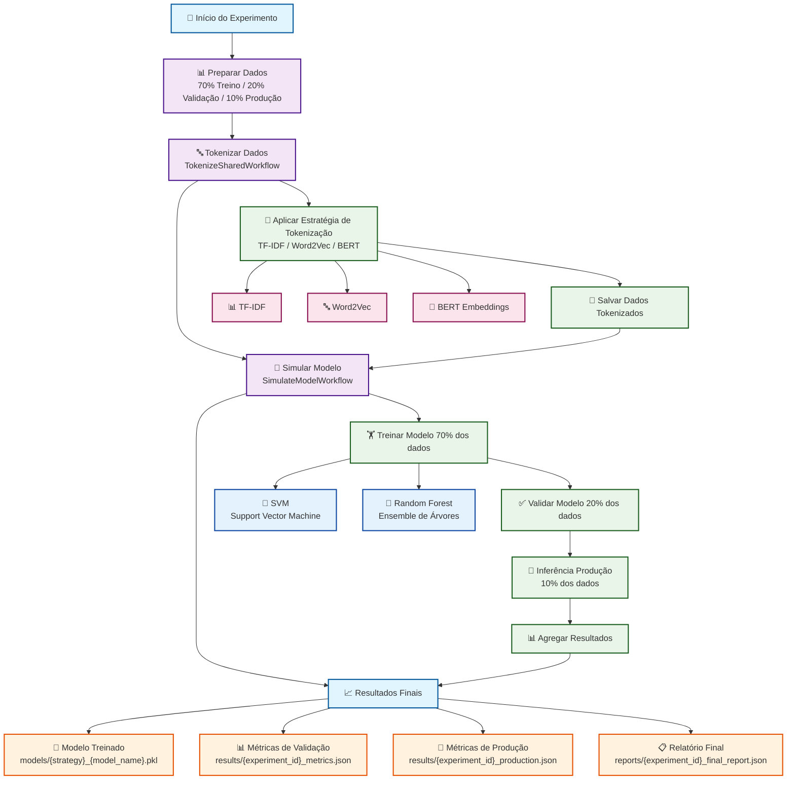
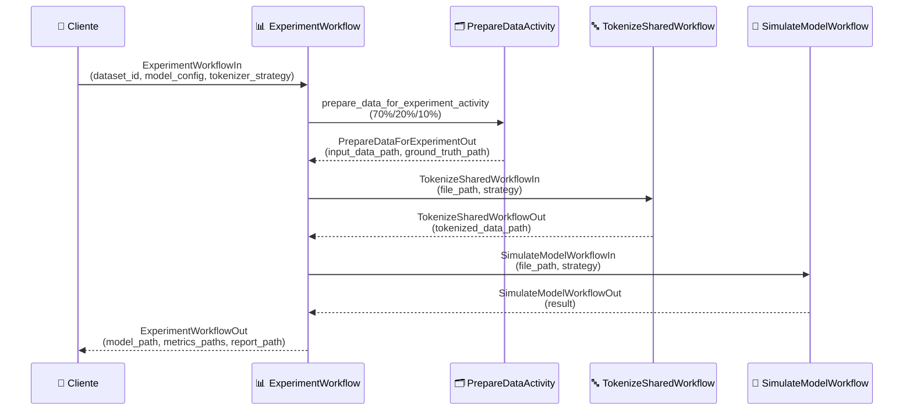
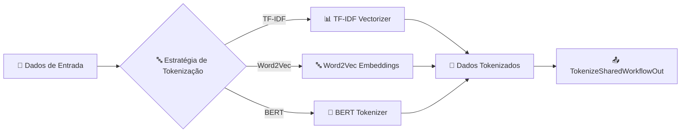
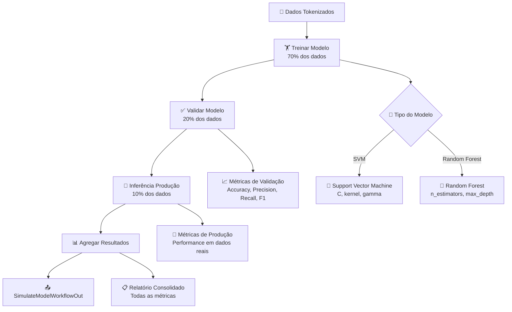
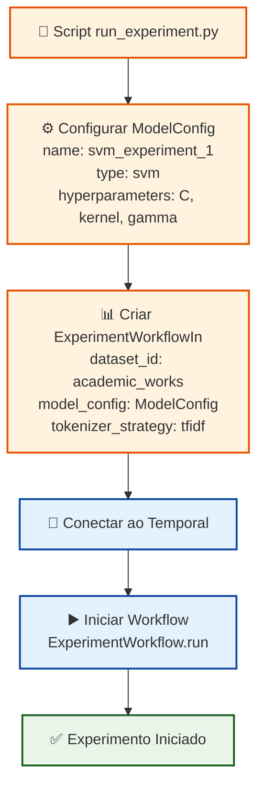
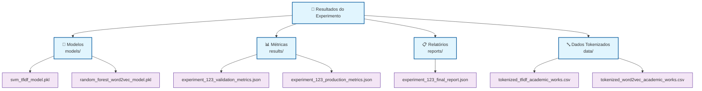
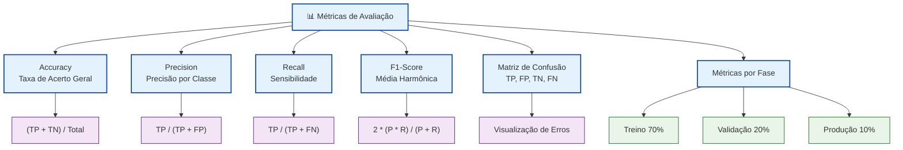

# Diagrama do Fluxo de Experimentos

## Fluxo Principal do ExperimentWorkflow

## Fluxo Detalhado por Componente

### 1. ExperimentWorkflow (Fluxo Principal)

### 2. TokenizeSharedWorkflow

### 3. SimulateModelWorkflow

## Configuração do Experimento (run_experiment.py)

## Estrutura de Arquivos de Saída

## Métricas de Avaliação

Este diagrama representa o fluxo completo do sistema de experimentos, desde a configuração inicial até a geração dos resultados finais, seguindo a estrutura documentada e implementada no código.
