# Diagrama do Fluxo de Experimentos

## Fluxo Principal do ExperimentWorkflow

```mermaid
flowchart TD
    A[🚀 Início do Experimento] --> B["📊 Preparar Dados<br/>70% Treino / 20% Validação / 10% Produção"]
    B --> C["🔤 Tokenizar Dados<br/>TokenizeSharedWorkflow"]
    C --> D["🤖 Simular Modelo<br/>SimulateModelWorkflow"]
    D --> E[📈 Resultados Finais]
    
    %% Detalhamento do TokenizeSharedWorkflow
    C --> C1["📝 Aplicar Estratégia de Tokenização<br/>TF-IDF / Word2Vec / BERT"]
    C1 --> C2["💾 Salvar Dados Tokenizados"]
    C2 --> D
    
    %% Detalhamento do SimulateModelWorkflow
    D --> D1["🏋️ Treinar Modelo 70% dos dados"]
    D1 --> D2["✅ Validar Modelo 20% dos dados"]
    D2 --> D3["🎯 Inferência Produção<br/>10% dos dados"]
    D3 --> D4["📊 Agregar Resultados"]
    D4 --> E
    
    %% Tipos de modelo
    D1 --> D1A["🔵 SVM<br/>Support Vector Machine"]
    D1 --> D1B["🌲 Random Forest<br/>Ensemble de Árvores"]
    
    %% Estratégias de tokenização
    C1 --> C1A["📊 TF-IDF"]
    C1 --> C1B["🔤 Word2Vec"]
    C1 --> C1C["🧠 BERT Embeddings"]
    
    %% Saídas
    E --> E1["📁 Modelo Treinado<br/>models/{strategy}_{model_name}.pkl"]
    E --> E2["📊 Métricas de Validação<br/>results/{experiment_id}_metrics.json"]
    E --> E3["🎯 Métricas de Produção<br/>results/{experiment_id}_production.json"]
    E --> E4["📋 Relatório Final<br/>reports/{experiment_id}_final_report.json"]
    
    %% Estilos
    classDef startEnd fill:#e1f5fe,stroke:#01579b,stroke-width:2px
    classDef workflow fill:#f3e5f5,stroke:#4a148c,stroke-width:2px
    classDef activity fill:#e8f5e8,stroke:#1b5e20,stroke-width:2px
    classDef output fill:#fff3e0,stroke:#e65100,stroke-width:2px
    classDef model fill:#e3f2fd,stroke:#0d47a1,stroke-width:2px
    classDef tokenizer fill:#fce4ec,stroke:#880e4f,stroke-width:2px
    
    class A,E startEnd
    class B,C,D workflow
    class D1,D2,D3,D4,C1,C2 activity
    class E1,E2,E3,E4 output
    class D1A,D1B model
    class C1A,C1B,C1C tokenizer
```

## Fluxo Detalhado por Componente

### 1. ExperimentWorkflow (Fluxo Principal)

```mermaid
sequenceDiagram
    participant Client as 🚀 Cliente
    participant EW as 📊 ExperimentWorkflow
    participant PDA as 🗂️ PrepareDataActivity
    participant TSW as 🔤 TokenizeSharedWorkflow
    participant SMW as 🤖 SimulateModelWorkflow
    
    Client->>EW: ExperimentWorkflowIn<br/>(dataset_id, model_config, tokenizer_strategy)
    EW->>PDA: prepare_data_for_experiment_activity<br/>(70%/20%/10%)
    PDA-->>EW: PrepareDataForExperimentOut<br/>(input_data_path, ground_truth_path)
    EW->>TSW: TokenizeSharedWorkflowIn<br/>(file_path, strategy)
    TSW-->>EW: TokenizeSharedWorkflowOut<br/>(tokenized_data_path)
    EW->>SMW: SimulateModelWorkflowIn<br/>(file_path, strategy)
    SMW-->>EW: SimulateModelWorkflowOut<br/>(result)
    EW-->>Client: ExperimentWorkflowOut<br/>(model_path, metrics_paths, report_path)
```

### 2. TokenizeSharedWorkflow

```mermaid
flowchart LR
    A[📁 Dados de Entrada] --> B{🔤 Estratégia de Tokenização}
    B -->|TF-IDF| C[📊 TF-IDF Vectorizer]
    B -->|Word2Vec| D[🔤 Word2Vec Embeddings]
    B -->|BERT| E[🧠 BERT Tokenizer]
    C --> F[💾 Dados Tokenizados]
    D --> F
    E --> F
    F --> G[📤 TokenizeSharedWorkflowOut]
```

### 3. SimulateModelWorkflow

```mermaid
flowchart TD
    A[📁 Dados Tokenizados] --> B[🏋️ Treinar Modelo<br/>70% dos dados]
    B --> C[✅ Validar Modelo<br/>20% dos dados]
    C --> D[🎯 Inferência Produção<br/>10% dos dados]
    D --> E[📊 Agregar Resultados]
    E --> F[📤 SimulateModelWorkflowOut]
    
    B --> B1{🤖 Tipo do Modelo}
    B1 -->|SVM| B2[🔵 Support Vector Machine<br/>C, kernel, gamma]
    B1 -->|Random Forest| B3[🌲 Random Forest<br/>n_estimators, max_depth]
    
    C --> C1[📈 Métricas de Validação<br/>Accuracy, Precision, Recall, F1]
    D --> D1[🎯 Métricas de Produção<br/>Performance em dados reais]
    E --> E1[📋 Relatório Consolidado<br/>Todas as métricas]
```

## Configuração do Experimento (run_experiment.py)

```mermaid
flowchart TD
    A[🚀 Script run_experiment.py] --> B[⚙️ Configurar ModelConfig<br/>name: svm_experiment_1<br/>type: svm<br/>hyperparameters: C, kernel, gamma]
    B --> C[📊 Criar ExperimentWorkflowIn<br/>dataset_id: academic_works<br/>model_config: ModelConfig<br/>tokenizer_strategy: tfidf]
    C --> D[🔗 Conectar ao Temporal]
    D --> E[▶️ Iniciar Workflow<br/>ExperimentWorkflow.run]
    E --> F[✅ Experimento Iniciado]
    
    classDef config fill:#fff3e0,stroke:#e65100,stroke-width:2px
    classDef workflow fill:#e3f2fd,stroke:#0d47a1,stroke-width:2px
    classDef success fill:#e8f5e8,stroke:#1b5e20,stroke-width:2px
    
    class A,B,C config
    class D,E workflow
    class F success
```

## Estrutura de Arquivos de Saída

```mermaid
graph TD
    A[📁 Resultados do Experimento] --> B[🤖 Modelos<br/>models/]
    A --> C[📊 Métricas<br/>results/]
    A --> D[📋 Relatórios<br/>reports/]
    A --> E[🔤 Dados Tokenizados<br/>data/]
    
    B --> B1[svm_tfidf_model.pkl]
    B --> B2[random_forest_word2vec_model.pkl]
    
    C --> C1[experiment_123_validation_metrics.json]
    C --> C2[experiment_123_production_metrics.json]
    
    D --> D1[experiment_123_final_report.json]
    
    E --> E1[tokenized_tfidf_academic_works.csv]
    E --> E2[tokenized_word2vec_academic_works.csv]
    
    classDef folder fill:#e1f5fe,stroke:#01579b,stroke-width:2px
    classDef file fill:#f3e5f5,stroke:#4a148c,stroke-width:1px
    
    class A,B,C,D,E folder
    class B1,B2,C1,C2,D1,E1,E2 file
```

## Métricas de Avaliação

```mermaid
flowchart TD
    A[📊 Métricas de Avaliação] --> B[Accuracy<br/>Taxa de Acerto Geral]
    A --> C[Precision<br/>Precisão por Classe]
    A --> D[Recall<br/>Sensibilidade]
    A --> E[F1-Score<br/>Média Harmônica]
    A --> F[Matriz de Confusão<br/>TP, FP, TN, FN]
    A --> G[Métricas por Fase]
    
    B --> B1["(TP + TN) / Total"]
    C --> C1["TP / (TP + FP)"]
    D --> D1["TP / (TP + FN)"]
    E --> E1["2 * (P * R) / (P + R)"]
    F --> F1[Visualização de Erros]
    G --> G1[Treino 70%]
    G --> G2[Validação 20%]
    G --> G3[Produção 10%]
    
    classDef metric fill:#e3f2fd,stroke:#0d47a1,stroke-width:2px
    classDef formula fill:#f3e5f5,stroke:#4a148c,stroke-width:1px
    classDef phase fill:#e8f5e8,stroke:#1b5e20,stroke-width:1px
    
    class A,B,C,D,E,F,G metric
    class B1,C1,D1,E1,F1 formula
    class G1,G2,G3 phase
```

Este diagrama representa o fluxo completo do sistema de experimentos, desde a configuração inicial até a geração dos resultados finais, seguindo a estrutura documentada e implementada no código.
