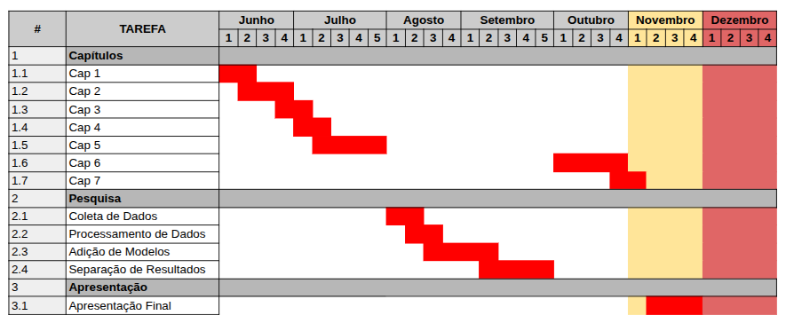

# Cronograma

Este é o cronograma planejado para as principais atividades do mestrado, incluindo redação dos capítulos, etapas de pesquisa e preparação da apresentação final.

A imagem abaixo apresenta uma visão geral mês a mês, do andamento esperado de cada tarefa:

## 🧾 Descrição das Etapas

### 1. Capítulos (Redação)
- **Cap 1 a Cap 4**: redigidos entre junho e agosto.
- **Cap 5**: planejado para outubro.
- **Cap 6**: início no final de outubro, com entrega em novembro.
- **Cap 7**: não planejado até dezembro (campo em branco).

### 2. Pesquisa
- **Coleta de Dados**: agosto.
- **Processamento de Dados**: entre agosto e setembro.
- **Adição de Modelos**: começa no final de agosto e se estende por setembro.
- **Separação de Resultados**: durante todo o mês de setembro.

### 3. Apresentação
- **Apresentação Final**: está prevista para o início de novembro e vai até a primeira semana de dezembro.

## 🗓️ Observações
- **Setores destacados em amarelo** indicam prazos críticos em novembro.
- **Setores em vermelho claro e escuro** indicam o fim do cronograma e entrega final.
- O cronograma permite identificar possíveis sobreposições e gargalos, especialmente nas etapas finais.

---

